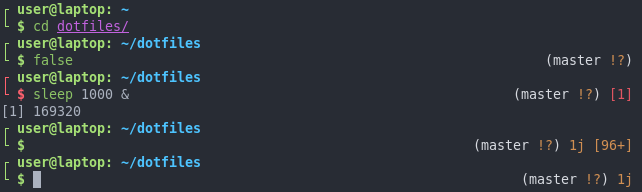
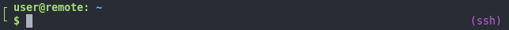

# Bref zsh theme

A simple zsh prompt. It shows the git status asynchronously, shows a ssh notification if the session is remote, the battery level and the ammount of background jobs.

The battery level visibility is toggleable using the `BREF_SHOW_BATTERY_BINDING` and is remembered for the next zsh sessions.

## Installation

Source `bref-zsh-prompt.zsh-theme` in your .zshrc or use your favorite plugin manager.

## More pictures

SSH notification if the session is remote.

The left part expands when displaying a long path.

## Configuration

|VARIABLE|EFFECT|
|-|-|
|BREF_SHOW_BATTERY_BINDING|The keybinding used to toggle the battery indicator on/off. Default: '^B' (Ctrl+B).|
|BREF_GIT_AHEAD|The icon to use for the git AHEAD status.|
|BREF_GIT_BEHIND|The icon to use for the git BEHIND status.|
|BREF_GIT_MERGING|The icon to use for the git MERGING status.|
|BREF_GIT_STAGED|The icon to use for the git STAGED status.|
|BREF_GIT_UNTRACKED|The icon to use for the git UNTRACKED status.|
|BREF_GIT_MODIFIED|The icon to use for the git MODIFIED status.|
|BREF_GIT_STASHED|The icon to use for the git STASHED status.|
|BREF_GIT_COLOR|The color to use for the git notification in RPROMPT |
|BREF_CODE_COLOR|The color to use for the command return code notification in RPROMPT.|
|BREF_SSH_COLOR|The color to use for the ssh notification in RPROMPT.|
|BREF_JOBS_COLOR|The color to use for the jobs notification in RPROMPT.|
|BREF_BATTERY_COLOR|The color to use for the battery notification in RPROMPT.|

You must use [zsh prompt expansions](https://zsh.sourceforge.io/Doc/Release/Prompt-Expansion.html#Visual-effects) (like '%F{red}', '%B', ...) in the BREF\_\*\_COLOR variables. You can also use them in the BREF\_GIT\_\* variables.
