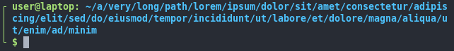

# Bref zsh theme

A simple zsh prompt. It shows the git status asynchronously, shows a ssh notification if the session is remote, the battery level and the ammount of background jobs.

## Installation

Source `bref-zsh-prompt.zsh-theme` in your .zshrc or use your favorite plugin manager.

## Configuration

|VARIABLE|EFFECT|
|-|-|
|BREF_BATTERY_VISIBLE|Shows battery percentage in RPROMPT if set, hidden if unset (can be toggled on/off using the BREF_SHOW_BATTERY_BINDING keybinding)|
|BREF_SHOW_BATTERY_BINDING|The keybinding used to toggle the battery indicator on/off. Default: '^B' (Ctrl+B).|
|BREF_GIT_AHEAD|The icon to use for the git AHEAD status.|
|BREF_GIT_BEHIND|The icon to use for the git BEHIND status.|
|BREF_GIT_MERGING|The icon to use for the git MERGING status.|
|BREF_GIT_STAGED|The icon to use for the git STAGED status.|
|BREF_GIT_UNTRACKED|The icon to use for the git UNTRACKED status.|
|BREF_GIT_MODIFIED|The icon to use for the git MODIFIED status.|
|BREF_GIT_STASHED|The icon to use for the git STASHED status.|

## More pictures

SSH notification if the session is remote.

The left part expands when displaying a long path.

